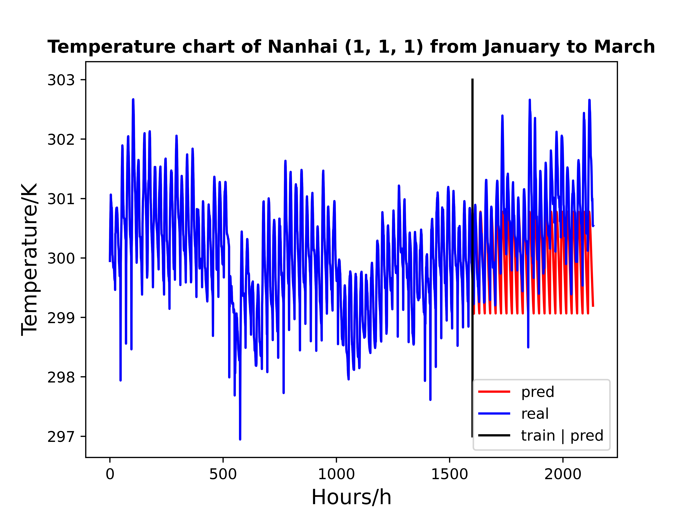

# Duct data time series forecast

本次数据处理的数据集来自南海区域2017年1月至三月的气象数据，其中各项气象参数所代表的含义如下表所示。

nx|ny|nl|nt|xlong|xlat|hgt|height
--|--|--|--|--|--|--|--
东西格点数|南北格点数|层数|时序数|经度|纬度|高度|海拔高度

z|e|pressure|Tem|QVAPOR|MM|NN
--|--|--|--|--|--|--
实际高度|水汽压|气压|温度|水汽混合比|大气折射率|修正大气折射率

由于原始数据使用气象专用格式存储，我这里已使用`getWRFData.py`程序提取到了1-3月nx=1的模拟数据，你可以在[这里](https://pan.baidu.com/s/1KXLhmSZLxvm5wBlsjbqXHg 
)（提取码：`sk23`）下载。下载后将`模拟数据`放入当前文件夹。

## usage
```bash
python timeData.py
```

> 提取`nx=1`、`ny=1`、`nl=1`的时序数据，当然也可更改提取数据的位置坐标。将提取到的数据放入`时序数据`文件夹下。

1. 滑动时间窗口观察预测效果

```bash
python timeSeries.py
```
- 数据预处理部分可以观察原始数据波动情况.

> 使用LSTM训练时序数据

- 输入为\[当前小时数，水汽压，气压，温度，水汽混合比],输出为下一时刻的\[水汽压，气压，温度，水汽混合比]，不断滑动窗口。

- 使用75%的数据作为训练集，25%数据作为测试集，训练效果如图`lstm_reg_long_term.png`所示。


- LSTM网络参数为：

  ```
  inp_dim = 5
  out_dim = 4
  mid_dim = 8
  mid_layers = 1
  batch_size = 48
  效果：L1(最小绝对值偏差): 1.474    L2(最小均方值偏差): 3.118
  ```
> 使用GRU训练时序数据
- 输入同上。

- 使用75%的数据作为训练集，25%数据作为测试集，训练效果如图`GRU_reg_long_term.png`所示。



- LSTM网络参数为：

  ```
  inp_dim = 5
  out_dim = 4
  mid_dim = 12
  mid_layers = 1
  batch_size = 48
  效果：L1(最小绝对值偏差): 1.197    L2(最小均方值偏差): 2.053
  ```
- 结论：气象参数长期预报情况不佳。但`GRU`较`LSTM`效果较好。

2. 模拟*WRF预报场原理*，使用传统全连接神经网络直接预报
```bash
python timeSeries_24h.py
```
> 预报场原理：预报场、初始场是相对于数值预报积分而言，比如3月19日00时刻的气象要素值作为数值模式的初始场（即初值），数值模式积分积分12小时到19日12时，得到预报场（即数值预报的结果）。
仿照WRF模式的运转过程，由于与序列无关，因此拿`CNN`训练模型。

输入为每天前1h/13h的气象参数数据，输出为后24h/12h的气象数据。
训练结果如`NN_1-24h.png`和`NN_12-13h.png`所示，误差较大,具体可见文件夹文件，缺乏*相关先验动力学条件*。

3. 补充实验：短期*48h*气象参数预报

利用1月1日-3月29日的数据，预报3月30-31日数据。由1知，GRU效果较LSTM来说更好，因此使用GRU进行预测。程序中调整训练集和测试集的比例即可。

> 预测结果：L1(最小绝对值偏差): 0.859    L2(最小均方值偏差): 1.101


